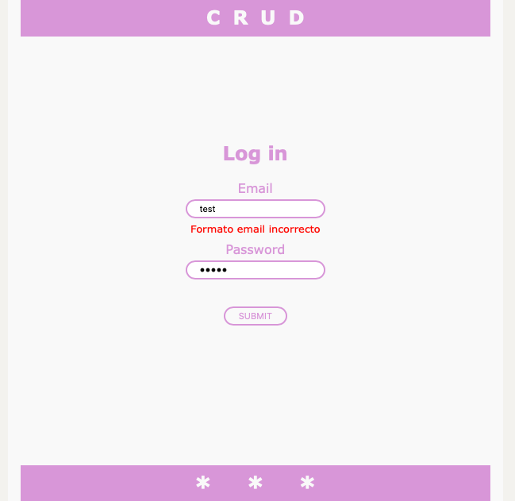
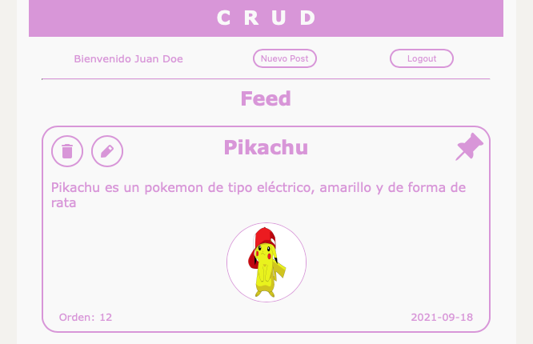
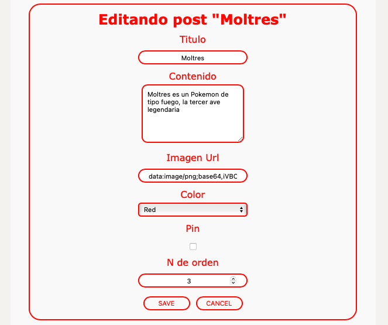

# CRUD

## Deploy

https://crud-evoion.vercel.app/

## Objetivo 

Desarrollar una aplicación que cuente con un login y un Feed de publicaciones con las opciones básicas de un CRUD

## Stack

React, NextJs, Prisma, styled-components, PostreSQL y Jest

## Funcionamiento

### Login

El Usuario por defecto es: admin@admin.com y la contraseña es: 123456 

El login posee comprobación del campo de mail (informa si se intenta logear con un mail sin el formato indicado) e informa si las credenciales no son válidas. Si se ingresa con un usuario correcto recibe nombre,apellido,token y redirige al Feed

### Token

El token es generado con JSON Web Token utilizando una palabra clave la id del usuario y su mail, en cada request generada se envía por cabecera HTTP y se valida desde la API. Se almacena utilizando el React Hook UseContext, por lo que la sesión se pierde al refrescar la página. Otras alternativas para evitar esto pueden ser almacenarlo en LocalStorage, por cookies, o utilizando una api externa como Firebase

### Feed

La ruta del feed se encuentra protegida y redirige si se ingresa a ella sin estar logeado comprobando el estado del useContext y utilizando router. Cuenta con dos botones (logout y nuevo post) y muestra el nombre y apellido del usuario. Debajo carga los posts que ha realizado el usuario.

### Posts

Los posts cuentan con id, titulo, contenido, una imagen (debe ingresar su url), un campo numerico de orden, un color que se selecciona utilizando SELECT, y un checkbox de Pinned,  la fecha de creacion y relacion con su autor. Además cuentan con dos botones, uno para eliminar y otro para editar.

### Orden de los Posts

Primero apareceran los posts cuya propiedad Pinned esta en true. Son aquellos que tienen el logo de un pin en la esquina superior derecha. Después apareceran ordenados por numero de orden de menor a mayor.

### Editar o Crear nuevo post

Se utiliza el mismo componente, cuenta con un formulario controlado. Es posible agregar posts sin contenido. En el pueden modificarse o agregarse segun corresponda los campos ya mencionados del post. Se controla que solo haya un componente de Crear nuevo post renderizado en el feed.

## Testing

Se realizaron dos pequeños test ínfimos. Únicamente testeando el renderizado del componente Nav y el componente Post. Para probarlos se debe agregar al archivo package.json dentro del objeto de scripts la siguiente linea 

    "test": "jest --watch"

y luego realizar por consola 

    npm run test

## Ejecución

Clonar el repositorio, realizar npm install, configurar un archivo .env con la siguiente informacion

    DATABASE_URL='direccion integra de la base de datos'
    TOKEN='palabra clave para la generacion del token'

Después debe generarse un usuario por defecto realizando un POST a la ruta
"/api/newUser" enviando por body un JSON con el siguiente formato

    {
	"email":"admin@admin.com",
	"password":"123456",
	"firstName":"Juan",
	"lastName":"Doe"
    }

La generación de usuarios está habilitada y pueden crearse cuantos quieran, cada uno con sus respectivos posts relacionados.

Despues realizar `npm run dev` y probar

## Mejoras

Los estilos tienen código repetido que podría ser refactorizado y reutilizado

Se ha implementado la librearía de iconos completa de styled-components lo cual genera problemas de performance. A futuro puede eliminarse y agregar los 3 svgs usados manualmente o buscar una de las sublibrerias de iconos de styled-components que tenga 3 iconos parecidos e instalar solo esa dependencia.

Implementar MediaQuery para mejorar el responsive

## Resoluciones

Fue realizado en 1366 x 768 y escala en resoluciones menores, en mayores los componentes quedan pequeños.

## Capturas

###

###

###

